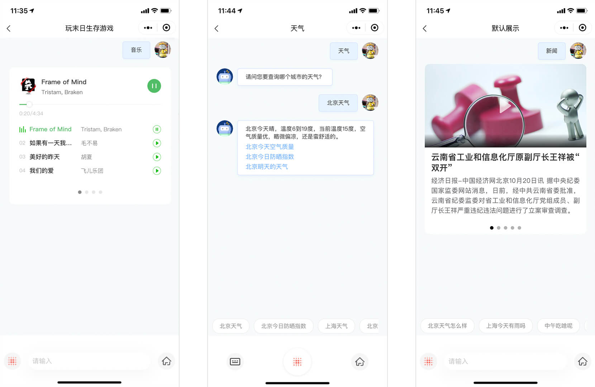
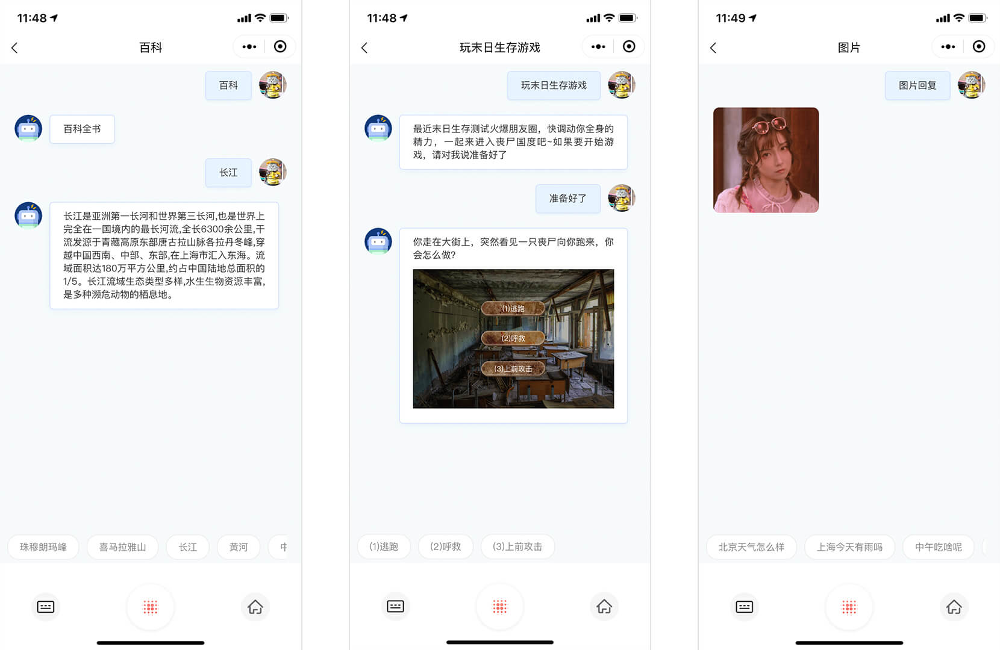
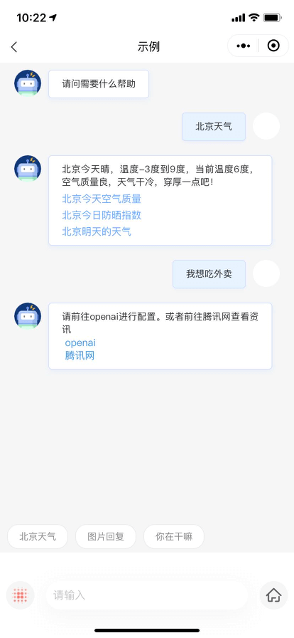

# 微信对话开放平台小程序插件复写示例(自定义导航栏版)

此项目为微信对话开放平台开源项目，用于微信开发者进行插件快速接入、 组件复写功能开发时的参考 Demo。微信开发者可以参考项目中的代码来开发应用，也可以直接使用项目中的代码到自己的 App 中。

开发者可以自由使用并传播本代码，但需要保留原作者信息。

联系我们：wechatopenai@tencent.com

插件申请使用地址：

https://mp.weixin.qq.com/wxopen/plugindevdoc?appid=wx8c631f7e9f2465e1

微信对话开放平台小程序插件复写示例提供了对插件的开放能力， 可以随意定制化。

> 请在 `project.config.json` 中配置自己小程序的 appid 或测试 ID
> 此示例代码仅做为接入微信对话开放平台小程序插件的示例供开发者参考





由于区分原始插件和复写插件, 所以当前页面将插件配置项在 `rewritePluginPage.js` 和 `originalPluginPage.js` 中初始化

在 `rewritePluginPage`中初始化

```js
var plugin = requirePlugin("myPlugin");
plugin.init({
    appid: "VEgbxLa9kYqzGOzstdeSF3xDbkS9zK",
    openid: "oB6jg6ENstneouhXefbujwJl7v2n", // 小程序的openid
    // textToSpeech: true,
    // guideList: [],
    welcome: "请问需要什么帮助",
    // background: "#eee",
    guideCardHeight: 50,
    operateCardHeight: 120,
    // history: true,
    // historySize: 60,
    navHeight: 88, // 自定义导航栏高度
    robotHeader:
        "https://res.wx.qq.com/mmspraiweb_node/dist/static/miniprogrampageImages/talk/leftHeader.png",
    userHeader:
        "https://res.wx.qq.com/mmspraiweb_node/dist/static/miniprogrampageImages/talk/rightHeader.png",
    userName: "",
    success: () => {
        this.setData({
            flag: true,
        });
    },
    fail: (error) => {},
});
```

在 `originalPluginPage`中初始化

```js
var plugin = requirePlugin("myPlugin");
plugin.init({
    appid: "VEgbxLa9kYqzGOzstdeSF3xDbkS9zK",
    openid: "oB6jg6ENstneouhXefbujwJl7v2n", // 小程序的openid
    // textToSpeech: true,
    // guideList: [],
    welcome: "请问需要什么帮助",
    // background: "#eee",
    // guideCardHeight: 40,
    // operateCardHeight: 145,
    // history: true,
    // historySize: 60,
    navHeight: 88, // 自定义导航栏高度
    robotHeader:
        "https://res.wx.qq.com/mmspraiweb_node/dist/static/miniprogrampageImages/talk/leftHeader.png",
    userHeader:
        "https://res.wx.qq.com/mmspraiweb_node/dist/static/miniprogrampageImages/talk/rightHeader.png",
    userName: "",
    success: () => {
        this.setData({
            flag: true,
        });
    },
    fail: (error) => {},
});
```

如果在 `app.js` 中初始化, 需要将 `rewritePluginPage.wxml` 中 `wx:if="{{flag}}"`删除

```js
var plugin = requirePlugin("myPlugin");
plugin.init({
    appid: "VEgbxLa9kYqzGOzstdeSF3xDbkS9zK",
    openid: "oB6jg6ENstneouhXefbujwJl7v2n", // 小程序的openid
    // textToSpeech: true,
    // guideList: [],
    welcome: "请问需要什么帮助",
    // background: "#eee",
    guideCardHeight: 50,
    operateCardHeight: 120,
    // history: true,
    // historySize: 60,
    navHeight: 88, // 自定义导航栏高度
    robotHeader:
        "https://res.wx.qq.com/mmspraiweb_node/dist/static/miniprogrampageImages/talk/leftHeader.png",
    userHeader:
        "https://res.wx.qq.com/mmspraiweb_node/dist/static/miniprogrampageImages/talk/rightHeader.png",
    userName: "",
    success: () => {},
    fail: (error) => {},
});
```

在 `rewritePluginPage.json` 中引入复写组件

## 1.普通文本组件复写示例

```json
{
    "usingComponents": {
        "customTextMessage": "../../components/customTextMessage/customTextMessage"
    }
}
```

## 2.天气组件复写示例

```json
{
    "usingComponents": {
        "customWeatherMessage": "../../components/customWeatherMessage/customWeatherMessage"
    }
}
```

## 3.图片组件复写示例

```json
{
    "usingComponents": {
        "customImageMessage": "../../components/customImageMessage/customImageMessage"
    }
}
```

## 4.引导消息组件复写示例

```json
{
    "usingComponents": {
        "customGuideCard": "../../components/customGuideCard/customGuideCard"
    }
}
```

## 5. 底部操作区域组件复写示例

```json
{
    "usingComponents": {
        "customOperateCard": "../../components/customOperateCard/customOperateCard"
    }
}
```

## 6. query 组件复写示例

```json
{
    "usingComponents": {
        "customQueryMessage": "../../components/customQueryMessage/customQueryMessage"
    }
}
```

## 7. 音乐组件复写示例

```json
{
    "usingComponents": {
        "customMusicMessage": "../../components/customMusicMessage/customMusicMessage"
    }
}
```

## 8. 新闻组件复写示例

```json
{
    "usingComponents": {
        "customNewsMessage": "../../components/customNewsMessage/customNewsMessage"
    }
}
```

## 9. 暂不支持组件复写示例

```json
{
    "usingComponents": {
        "customUnsupportedMessage": "../../components/customUnsupportedMessage/customUnsupportedMessage"
    }
}
```

## 10. H5 组件复写示例

```json
{
    "usingComponents": {
        "customh5Message": "../../components/customh5Message/customh5Message"
    }
}
```

## 11. 小程序组件复写示例

```json
{
    "usingComponents": {
        "customMiniprogramMessage": "../../components/customMiniprogramMessage/customMiniprogramMessage"
    }
}
```

## License Copyright (c) 2019 Tencent

Permission is hereby granted, free of charge, to any person obtaining a copy of this software and associated documentation files (the "Software"), to deal in the Software without restriction, including without limitation the rights to use, copy, modify, merge, publish, distribute, sublicense, and/or sell copies of the Software, and to permit persons to whom the Software is furnished to do so, subject to the following conditions:

The above copyright notice and this permission notice shall be included in all copies or substantial portions of the Software.

THE SOFTWARE IS PROVIDED "AS IS", WITHOUT WARRANTY OF ANY KIND, EXPRESS OR IMPLIED, INCLUDING BUT NOT LIMITED TO THE WARRANTIES OF MERCHANTABILITY, FITNESS FOR A PARTICULAR PURPOSE AND NONINFRINGEMENT. IN NO EVENT SHALL THE AUTHORS OR COPYRIGHT HOLDERS BE LIABLE FOR ANY CLAIM, DAMAGES OR OTHER LIABILITY, WHETHER IN AN ACTION OF CONTRACT, TORT OR OTHERWISE, ARISING FROM, OUT OF OR IN CONNECTION WITH THE SOFTWARE OR THE USE OR OTHER DEALINGS IN THE SOFTWARE.

```

```
