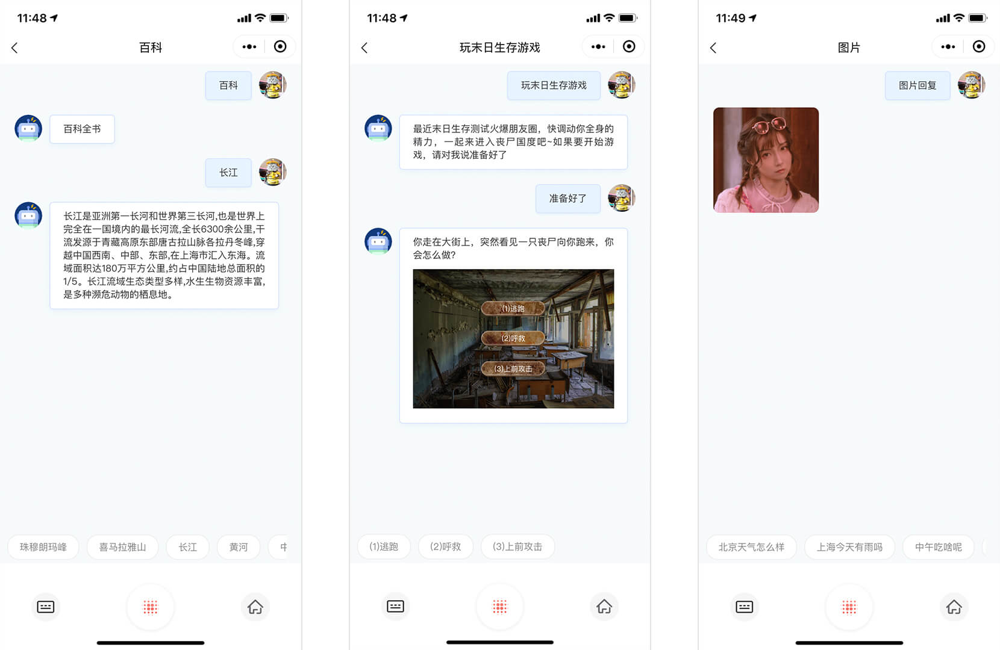

# 微信对话开放平台小程序插件复写示例
微信对话开放平台小程序插件复写示例提供了对插件的开放能力， 可以随意定制化。




## 1.普通文本组件复写示例

```json

{
  "usingComponents": {
    "customTextMessage": "../customTextMessage/customTextMessage"
  }
}

```

## 2.天气组件复写示例

```json

{
  "usingComponents": {
    "customWeatherMessage": "../customWeatherMessage/customWeatherMessage"
  }
}

```

## 3.图片组件复写示例

```json

{
  "usingComponents": {
    "customImageMessage": "../customImageMessage/customImageMessage"
  }
}

```

## 4.引导消息组件复写示例

```json

{
  "usingComponents": {
    "customGuideCard": "../customGuideCard/customGuideCard"
  }
}

```

## 5. 底部操作区域组件复写示例

```json

{
  "usingComponents": {
    "customOperateCard": "../customOperateCard/customOperateCard"
  }
}

```

## 6. query组件复写示例

```json

{
  "usingComponents": {
    "customQueryMessage": "../customQueryMessage/customQueryMessage"
  }
}

```

## 7. 音乐组件复写示例

```json

{
  "usingComponents": {
    "customMusicMessage": "../customMusicMessage/customMusicMessage"
  }
}

```

## 8. 新闻组件复写示例

```json

{
  "usingComponents": {
    "customNewsMessage": "../customNewsMessage/customNewsMessage"
  }
}

```

## 9. 暂不支持组件复写示例

```json

{
  "usingComponents": {
    "customUnsupportedMessage": "../customUnsupportedMessage/customUnsupportedMessage"
  }
}

```
